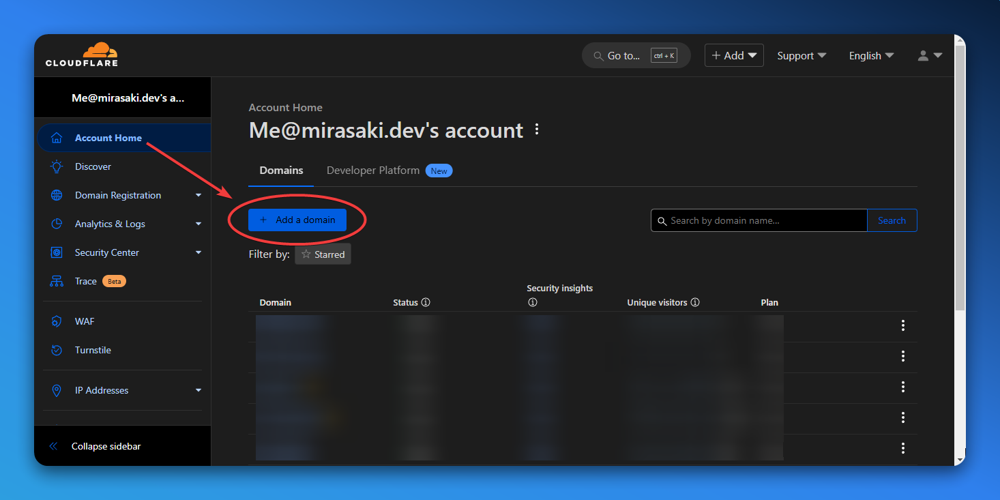
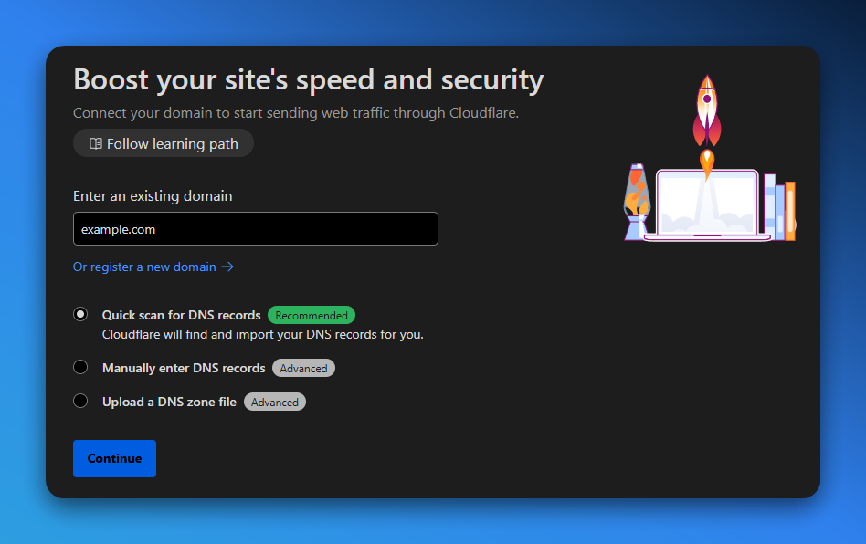
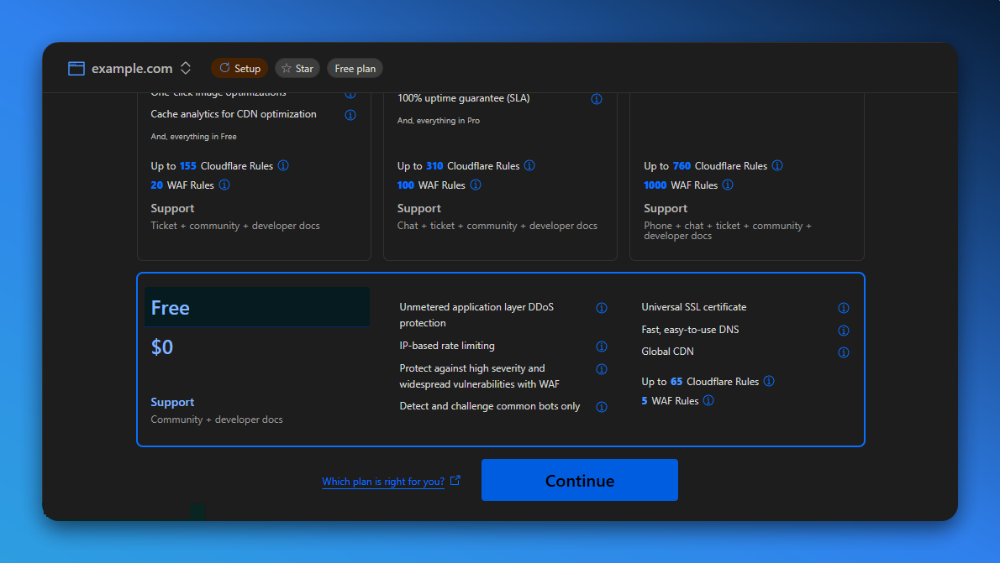
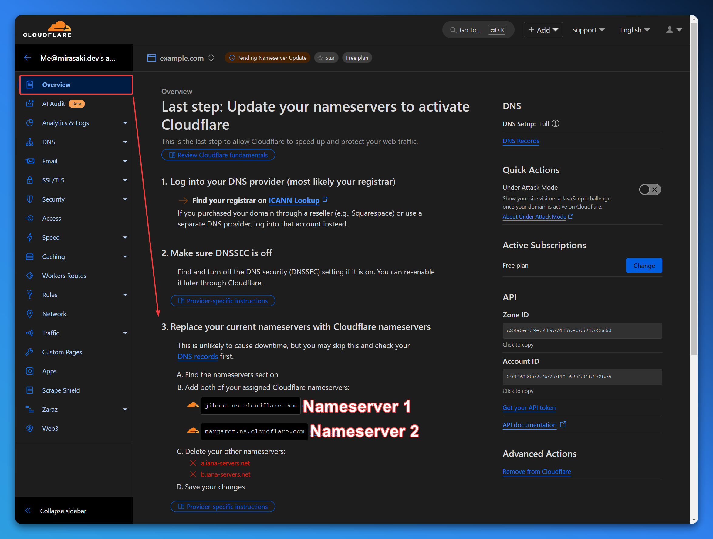
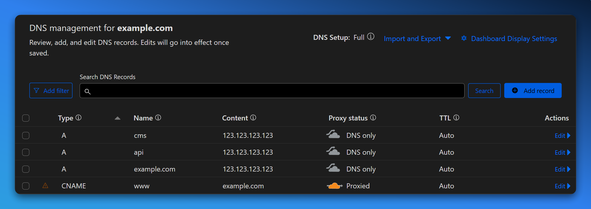
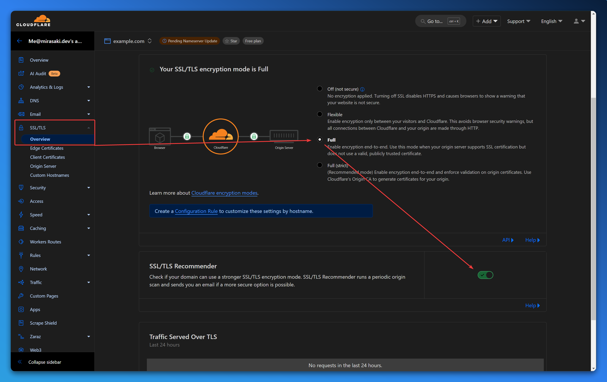
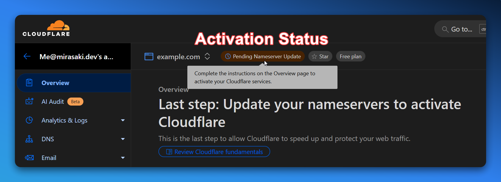

import { SunMoonIcon } from "lucide-react";
import { Step, Steps } from "fumadocs-ui/components/steps";
import { InstanceProperty } from "@/components/instance-data";
import DocsNotPersonalized from "@/components/docs-not-personalized";

<Callout type="info" icon={<SunMoonIcon className="text-yellow-500" />}>
    Flash bang! You can enable Cloudflare dark-mode on the [preferences page](https://dash.cloudflare.com/profile#appearance-preference-card).
</Callout>

<Steps>
    <Step>
        ### Log in or Sign Up

        If you don't already have a Cloudflare account, you can sign up for free at [cloudflare.com](https://www.cloudflare.com/).
    </Step>

    <Step>
        ### Add a Domain

        Once you're logged in, click on the "Add a domain" button in the top left corner of the "Account Home" page.

        

        Enter your domain name, select "Quick scan for DNS records" and click "Add site".

        

        Select the free plan/tier at the bottom of the page, and click "Continue".

        
    </Step>

    <Step>  
        ### Update Nameservers

        Cloudflare will provide you with two nameservers that you will need to update with your domain registrar. You can find these nameservers on the "Overview" page for your domain.

        <Callout type="info">
            If you're not sure how to update your nameservers, you can find detailed instructions on the same/current "Overview" page, or alternatively, you can find more information in the [Cloudflare documentation](https://developers.cloudflare.com/dns/zone-setups/full-setup/setup/).
        </Callout>

        
    </Step>

    <Step>
        ### Configure DNS Records

        After updating your nameservers, you will be taken to the "DNS" page for your domain. Here you can add, edit, and delete DNS records for your domain. Configure the following DNS records:

        <DocsNotPersonalized />

        | Type | Name | Value | TTL | Description |
        | ---- | ---- | ----- | --- | ----------- |
        | CNAME | www | <InstanceProperty property='webUrl' stripSchemeFromUrls /> | Auto | Redirects `www.example.com` to `example.com`, **not recommended if you are using a subdomain for the web/frontend**. |
        | CNAME | @ | <InstanceProperty property='region' transformRegionToProxyServer /> | Auto | Points the root of the domain to your MGSM instance, you can use any subdomain (like `store` or `shop`) instead of `@`. |
        | CNAME | api | <InstanceProperty property='region' transformRegionToProxyServer /> | Auto | Points the API subdomain to your MGSM instance API, use a different `name` if you would like to use a different subdomain. |
        | CNAME | cms | <InstanceProperty property='region' transformRegionToProxyServer /> | Auto | Points the CMS subdomain to your MGSM instance CMS, use a different `name` if you would like to use a different subdomain. |

        <Callout type="info" className="-mt-2 mb-4">
            Please note that you should use `proxy-eu-1.mgsm.io` if you want to be hosted in Europe, and `proxy-na-1.mgsm.io` if you want to be hosted in North-America.
        </Callout>

        <Callout type="warn">
            **Disable the "Proxy Status" checkbox for all records except the `www` record.** If there is any issues with your configuration, we will notify you when we try to verify the domain.
        </Callout>

        When you're done, the DNS page should look something like this (notice the orange cloud icon for the `www` record, and how it's grayed out for the other records):

        
    </Step>

    <Step>
        ### Enable SSL/TLS

        Click on the "SSL/TLS" tab in the left-hand menu, and select the "Full" encryption mode. This will encrypt traffic between Cloudflare and your MGSM instance, and between Cloudflare and your visitors. You can also enable "SSL/TLS Recommender" to be notified when you can upgrade your encryption mode.

        <Callout type="warn">
            When Cloudflare verifies your domain, it will automatically issue an SSL certificate for your domain and update this setting to "Flexible". Once this happens, you should change the encryption mode to "Full" or "Full (strict)".
        </Callout>

        
    </Step>

    <Step>
        ### Wait for Activation

        After updating your nameservers, you will need to wait for Cloudflare to activate your domain. This process can **technically** take up to 48 hours, but is usually much quicker (usually within 15 minutes).

        #### Verify your email (if needed)

        If you just signed up for an account, and didn't log in with Google, you will need to verify your email address. Cloudflare will send you an email with a link to verify your email address, and will not activate your domain until this verification is complete.

        #### Check the activation status

        You can check the activation status of your domain on the "Overview" page for your domain. Once your domain is activated, you will see a green checkmark next to the domain name. If the badge is not green, you can hover over it to see the current status, and any issues that need to be resolved.

        
    </Step>
</Steps>

When you're done, and your domain is activated/verified, please navigate back to "TLS/SSL" and make sure that the encryption mode is set to either "Full" or "Full (strict)".
