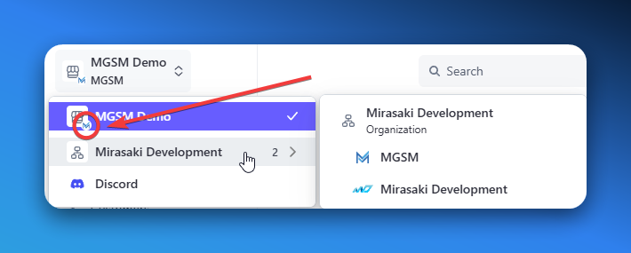
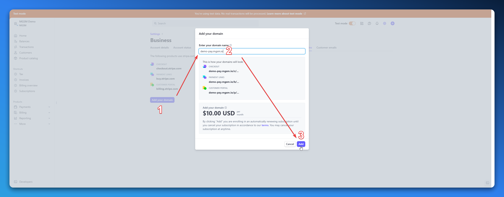
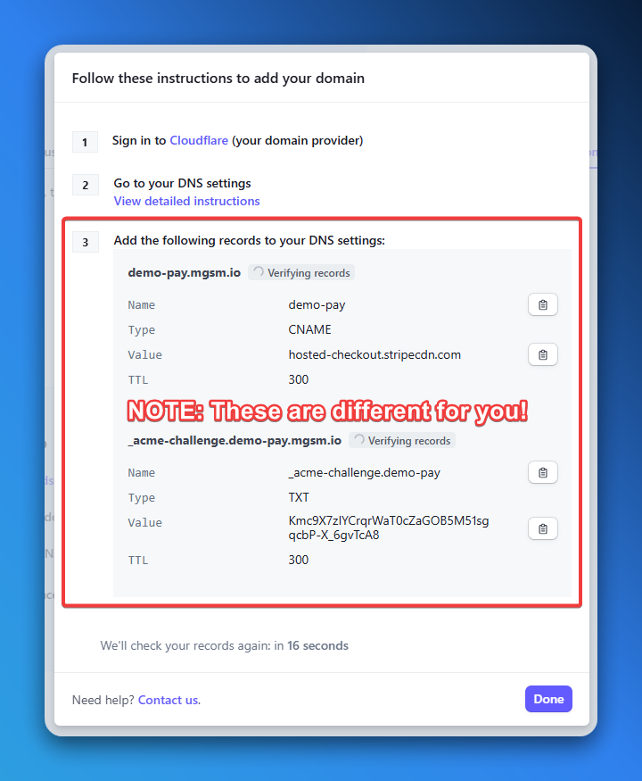
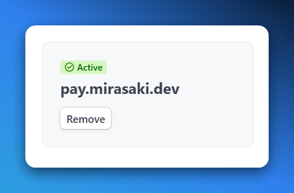

import { Step, Steps } from "fumadocs-ui/components/steps";

## Prerequisites

To get started, you will need to create a Stripe account for MGSM. You likely already have a Stripe account for MGSM if you have completed the onboarding process. If you do not have a Stripe account, you can create one [here](https://onboarding.mgsm.io/).

## The MGSM account

Before we start, let's take a look at the MGSM account in the Stripe dashboard. The "MGSM account" is the account that is used to manage all the payments and transactions for your MGSM instance. It is indicated by the small MGSM logo in the bottom-right corner of the Stripe account/store icon.

<Callout type="warn">
    If you installed the MGSM account under an organization, you will **not** see the MGSM logo - please take a mental note of which store is your MGSM account when using multiple Stripe accounts under an organization.
</Callout>



## Use Custom Domain

To use a custom (checkout) domain with Stripe, you will need to set up a CNAME record with your domain registrar. This will allow you to use your own domain for the checkout process instead of the default Stripe domain (e.g. `checkout.stripe.com`).

{/* Note about custom domains being a paid Stripe feature */}
<Callout type="warn">
    Using a custom domain with Stripe is a paid feature. They currently charge 10 USD per month for each custom domain. You can find more information about custom domains in the [Stripe documentation](https://docs.stripe.com/payments/checkout/custom-domains).
</Callout>

<Steps>
    <Step>
        ### Configure the domain in Stripe

        To configure a custom domain in Stripe, navigate to the "Settings" page in the Stripe dashboard and click on the ["Custom domains" tab](https://dashboard.stripe.com/settings/custom-domains). Here you can enter your custom domain and save the changes.

        <Callout type="info">
            Note: This example uses `demo-pay.mgsm.io`, we usually see `checkout.example.com` or `pay.example.com` as custom domains.
        </Callout>

        
    </Step>

    <Step>
        ### Add a CNAME record

        After configuring the domain in Stripe, you will need to add a CNAME and TXT record with your domain registrar.

        <Callout type="info">
            If you're not sure how to add a CNAME record, you can find detailed instructions in the [Stripe documentation](https://stripe.com/docs/payments/checkout/custom-domains#create-dns-records), alternatively, check out our docs for [Cloudflare](/docs/advanced/cloudflare).
        </Callout>

        

        <Callout type="warn">
            If you are using Cloudflare, the CNAME records should have the orange cloud (proxy status) disabled (DNS only).
        </Callout>
    </Step>

    <Step>
        ### Verify the domain

        After adding the CNAME and TXT records **and waiting ~10 minutes**, you can verify the domain in the Stripe dashboard. If the domain is verified successfully, you can start using the custom domain for the checkout process.

        If you're comfortable using the CLI, you can use the following command to check if the domain is verified:

        ```bash
        nslookup -querytype=CNAME demo-pay.mgsm.io dora.ns.cloudflare.com
        ```

        In the example above, replace `demo-pay.mgsm.io` with your custom domain and `dora.ns.cloudflare.com` with your domain registrar's nameservers.

        
    </Step>
</Steps>
