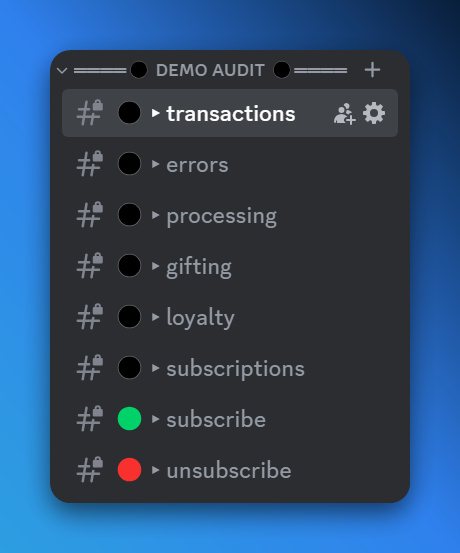

## Discord Webhook Logging

As of now, MGSM supports Discord webhooks for logging. These webhooks are used to notify you about certain events that occur in your MGSM instance. Discord webhook logging categorizes all events into these categories:

<Card
    title="Creating a Discord Webhook"
    href="/docs/integrations/discord/webhooks"
>
    If you're not sure how to create a Discord webhook, click here to learn more.
</Card>

- **Transactions**: This event is triggered whenever a transaction is made in your MGSM instance - aka. whenever a user buys something.
- **Errors**: This event is triggered whenever an error is encountered. This can be while processing a transaction, or while expiring perks, etc.
- **Processing**: This event is triggered for every "action" performed by our system when fulfilling a transaction. This includes sending a message to the user, applying priority queue, expiring a perk, etc.
- **Gifting**: This event is triggered whenever a user gifts a perk to another user, or when a user redeems a gift card.
- **Loyalty**: This event is triggered when a user reaches a new loyalty tier.
- **Subscriptions**: This event is triggered whenever there's an update regarding a user's subscription status. Created, updated, cancelled, etc.
- **Subscribe**: This event is triggered when a new subscription is created/purchased.
- **Unsubscribe**: This event is triggered when a subscription is cancelled.

You can either provide a webhook URL for every category/event, a single webhook URL for all events, or a combination of both. If you provide a webhook URL for a specific event, it will override the default webhook that is used for all events.

## Custom Webhooks

In the future, we plan to add support for more webhook providers, including custom webhooks. This update is largely dependent on the [public API update](https://github.com/Mirasaki-MGSM/issue-tracker/issues/71), which aims to provide a robust and flexible interface for interacting with MGSM programmatically. Stay tuned for updates!
