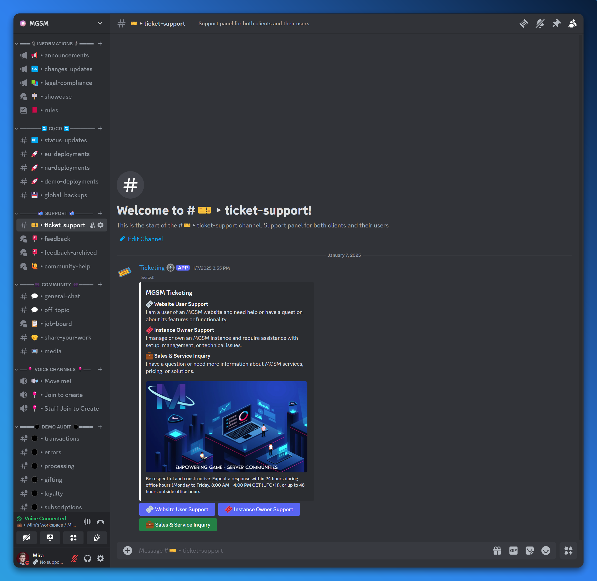
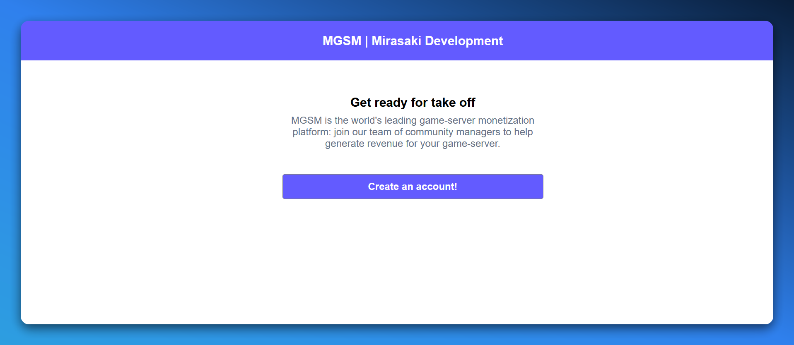
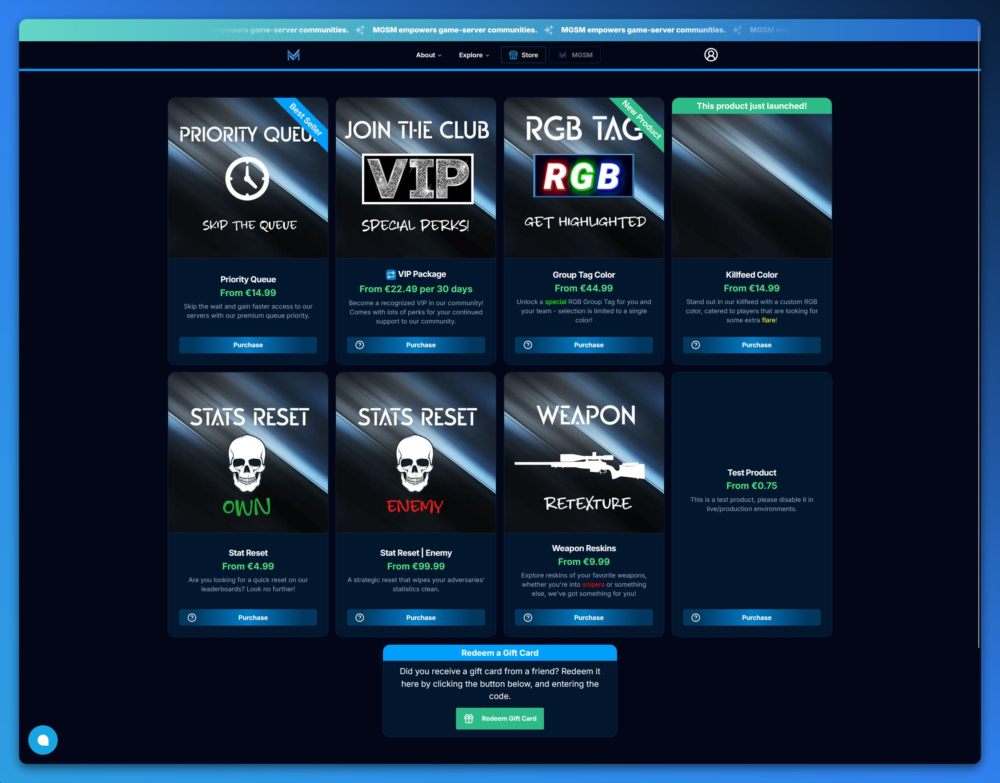

import { Step, Steps } from 'fumadocs-ui/components/steps';
import { RocketIcon } from 'lucide-react';

## Pre-requisites

### Requirements

Before you can get started with MGSM, you will need to have the following:

1. [x] Game-server or community
2. [x] Valid email address
3. [x] Excitement to get started!

### Preparation

Before you start the onboarding process, please make sure you followed the [preparation steps](/docs/getting-started/preparation) to ensure that you have all the necessary information ready. While not technically required, it will make the onboarding process much smoother and quicker.

## Onboarding process

<Steps>
    <Step>
        ### [Beta] Create a sales ticket

        The first step in the onboarding process is to create a sales ticket. You can do this by visiting the [MGSM Discord server](https://discord.gg/mgsm) and navigating to the `#🎫▸ticket-support` channel. You will need to provide some basic information, such as your name, email address, etc.

        <Callout type="info">
            Note that the platform is currently in beta, and you will need to create a sales ticket to get started. You will **not** be eligible for an instance until your explicitly agree to the terms and conditions of the platform - you will prompted to do so during the onboarding process.
        </Callout>

        
    </Step>

    <Step>
        ### [Live] Sign Up

        The second step is to sign up for an account. You can do this by visiting the [MGSM website](https://mgsm.io) and clicking the "Sign Up" button. You will need to provide some basic information, such as your name, email address, etc.

        <Callout type="warn">
            Please use the standalone [onboarding website](https://onboarding.mgsm.io) to sign up for an account while the platform is in beta, or follow the [[Beta] step](#create-a-sales-ticket-beta) above to get started.
        </Callout>

        
    </Step>

    <Step>
        ### <RocketIcon className='inline-flex' /> Lift off!

        Once you have created an account and signed up, you will be able to access the platform and start configuring your instance. The next steps will guide you through the process of setting up your instance and getting you ready to start monetizing your game-server.

        
    </Step>

</Steps>
