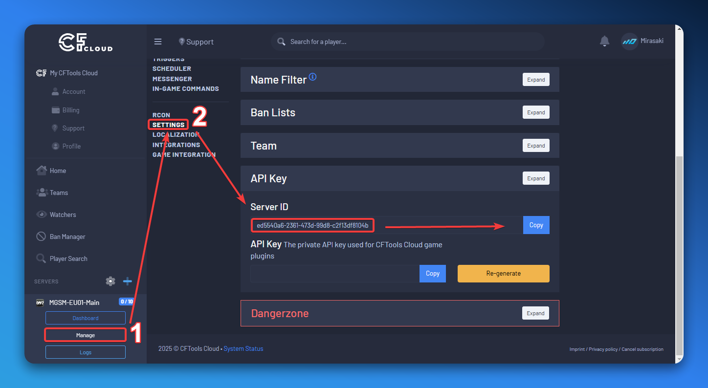

import { PlusIcon } from "lucide-react";

## Overview

MGSM integrates with CFTools to manage priority queues, whitelist players, and fetch information about your configured servers.

## Access Grant

To allow MGSM to interact with your CFTools servers, you need to Grant Access for the (game-)servers you want MGSM to manage. If you do not perform this step, MGSM will not be able to interact with your servers over the [CFTools Data API](https://help.cftools.com/en/api-1/data-api).

<Card
    icon={<PlusIcon className="text-green-500" />}
    href="https://app.cftools.cloud/authorize/6709668146b3a1fc4c9de212"
    type="info"
    title="Access Grant"
>
    Click here to open the CFTools website and grant access to available resources.
</Card>

## Server Api Id

To allow MGSM to interact with your CFTools servers, you need to provide the Server API ID. You can find this ID here:

1. Go to the [CFTools App](https://app.cftools.cloud/dashboard) and log in with your CFTools account.
2. Select the server you want to obtain the Server API ID for in the sidebar, and click "Manage".
3. Navigate to "Settings" > "API Key" > "Server ID".

<Callout type="warn">
    The **Server API ID** is different from your normal server ID. If you encounter any `Unknown Resource` or `Resource Not Found` errors, you're likely using the wrong ID.
</Callout>

