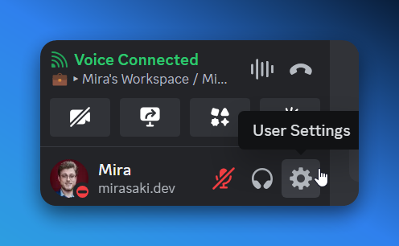
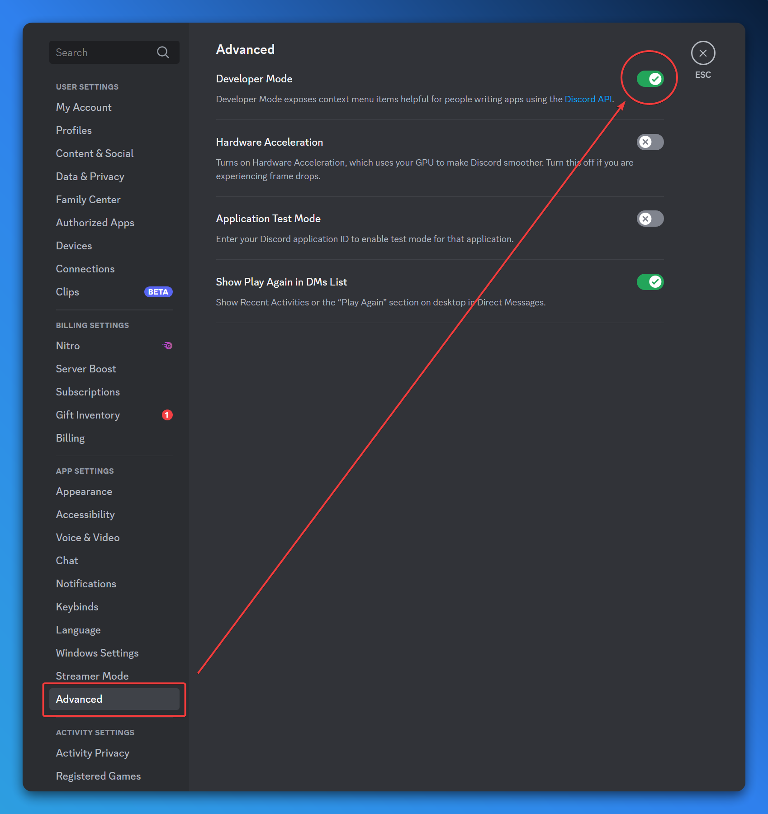
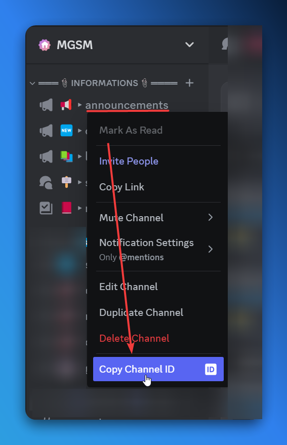

import { Step, Steps } from "fumadocs-ui/components/steps";

## Instructions

<Steps>
    <Step>
        ### Go to your Discord settings

        Open Discord and click on the gear icon in the bottom left corner to open your settings.

        
    </Step>

    <Step>
        ### Enable Developer Mode

        In the settings, scroll down to the "Advanced" section and toggle the "Developer Mode" switch to enable it.

        
    </Step>

    <Step>
        ### Get the ID

        Right-click on a user, channel, role, etc. and click on "Copy ID" to get the ID. This can be done for most things in Discord.

        
    </Step>
</Steps>
