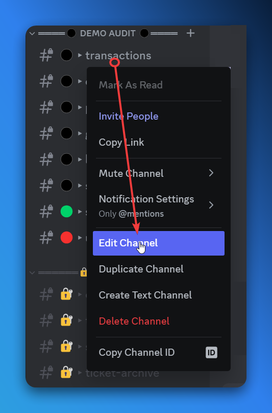
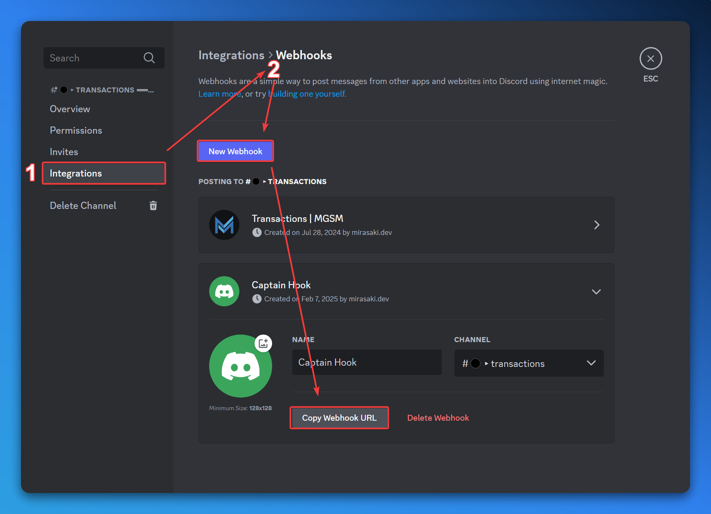

import { Steps, Step } from "fumadocs-ui/components/steps";

## Creating a Discord Webhook

<Steps>
    <Step>
        ### Go to channel settings

        Right-click on the channel you want to create a webhook for and click on "Edit Channel".

        
    </Step>

    <Step>
        ### Create a webhook

        Click on the "Integrations" tab, "Webhooks" section, and then click on "Create Webhook".

        <Callout type="info">
            While you don't have to give your webhook a name, it's recommended to do so for better organization. That said, MGSM will override the configured name when sending messages to your webhook.
        </Callout>

        
    </Step>
</Steps>