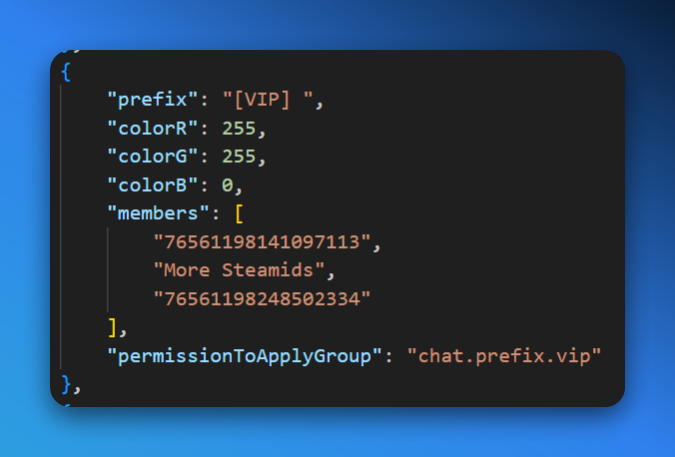

Chat prefixes are small tags that appear before a player's name when they type in the in-game chat. They can be used to show off a player's rank, group, or other information. They apply to all players in the group the perk is purchased for.

<Callout type="info">
    Chat prefixes are created for you if an invalid/non-existent `prefixGroupToApply` is provided. We have plans to support custom player prefixes in the future.
</Callout>

## Setting Up

- **CMS Module/Component**: `Product (Variant)` > `Perks` > `prefixGroupToApply`
- **LB Mod**: [Advanced Groups](https://lbmaster.de/product.php?id=4)
- **LB Master Config File**: `profiles\LBmaster\Config\LBGroup\ChatConfig.json`
    - Prefix groups are configured under `prefixGroups`.
    - `prefixGroups#permissionToApplyGroup` is the `permissionToApplyGroup` from the Product (Variant) configuration.
- **LB Master Data File**: None

<Callout type="warn">
    If you configure a `permissionToApplyGroup` on the CMS, you must also configure it in the LB Master config file. If you don't, the player will be added to the first entry in your `prefixGroups` array instead - which can be destructive if that first entry is your admin group.
</Callout>