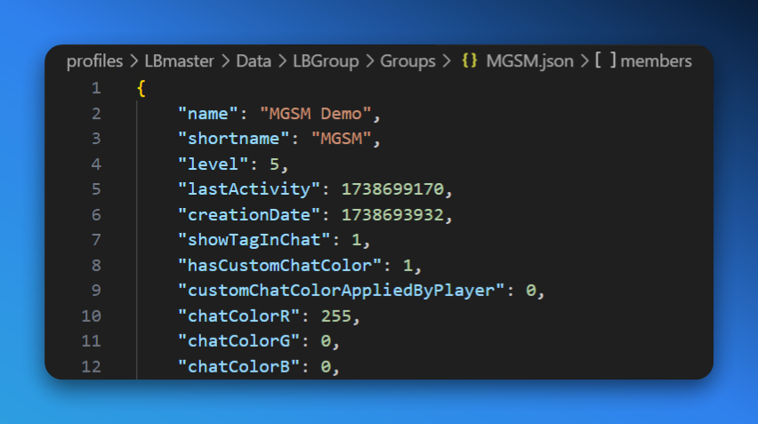

Group Tag Colors allow group member to assign a custom chat colors for all their members. This can be used to differentiate between groups in chat, making it easier to identify who is speaking, and stand out from the rest of the players. 

## Setting Up

- **CMS Module/Component**: `Product (Variant)` > `Modules` > `Perks` > `Chat Tag Color`
- **LB Mod**: [Advanced Groups](https://lbmaster.de/product.php?id=4)
- **LB Master Config File**: None
- **LB Master Data File**: `profiles\LBmaster\Data\LBGroup\Groups\{{GROUP_SHORTNAME}}.json`
    - `showTagInChat`: Wether the group tag should be shown in chat.
    - `hasCustomChatColor`: Wether the group *has* a custom chat color.
    - `customChatColorAppliedByPlayer`: Wether the custom chat color is applied by a player (true) or the server/system (false).
    - `chatColorR`, `chatColorG`, `chatColorB`: The RGB values of the custom chat color.

<Callout type="info">
    A player is required to be in a group to be eligible to purchase a group tag color. If they are not in a group, they will not be able to purchase the product.
</Callout>

## Configuration

Multiple different configurations are available for (group) chat prefixes:

- **Direct**: If `useRedeemPoints` is disabled on the CMS, a `inputName` is required (`Product (Variant)` > `Form Input#name`) which is used to collect the color, and is directly applied to the group through our connection to the LB Core API.
- **Indirect**: If `useRedeemPoints` is enabled on the CMS, the user that purchases the product will be able to select a color in-game (`Map` > `Group`), consuming the point they purchased.