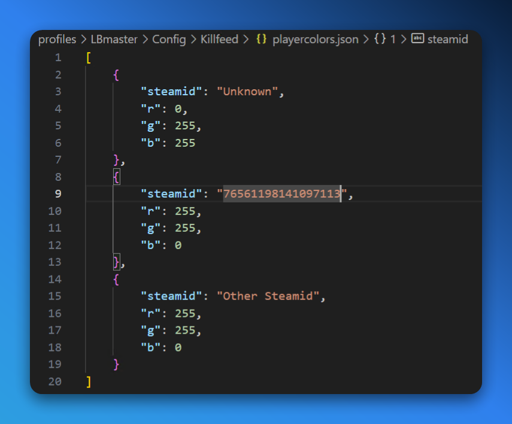

Killfeed colors can be used to change the color of a players name on the killfeed in-game, making them stand out.

<Callout type="info">
    Killfeed colors are currently only available as `player` products/perks, we have plans to make them available as `group` products in the future.
</Callout>

## Setting Up

- **CMS Module/Component**: `Product (Variant)` > `Modules` > `Perks` > `Killfeed Color`
- **LB Mod**: [Graphical Killfeed](https://lbmaster.de/product.php?id=18)
- **LB Master Config File**: `profiles\LBmaster\Config\Killfeed\config.json`
- **LB Master Data File**: `profiles\LBmaster\Config\Killfeed\playercolors.json`

## Configuration

- `config.json`: This file is used to configure the killfeed, is does not have anything player-specific.
- `playercolors.json`: A player is added to this file once they purchase a custom killfeed color product/perk. This file is used to store the player's SteamID and the color they've chosen.