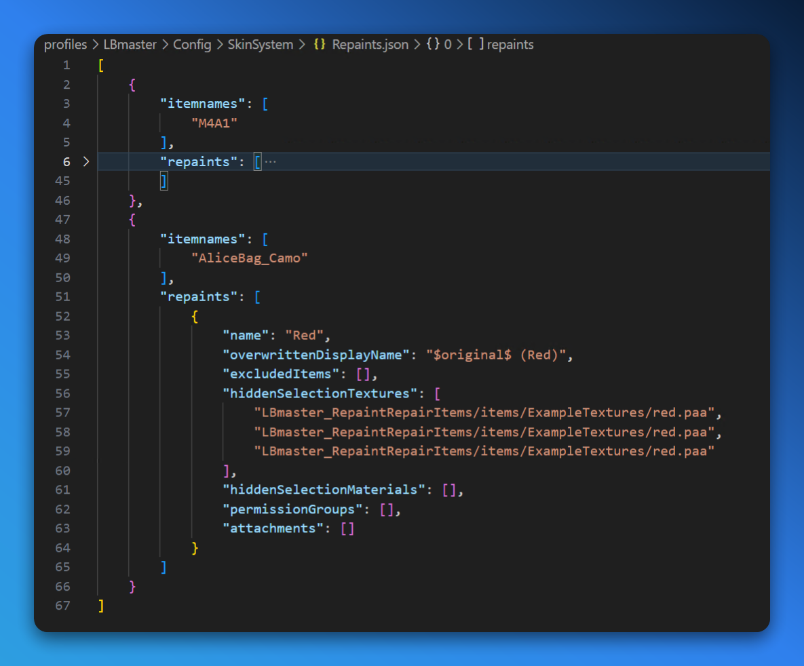

Skins can be used to change the appearance of a player's character in-game. They can alter the appearance of any item, including weapons, armor, and vehicles.

<Callout type="info">
    Skins are available as both `player` and `group` products/perks, and are only cosmetic changes - they do not affect gameplay, or provide any advantages.
</Callout>

## Setting Up

- **CMS Module/Component**: `Product (Variant)` > `Modules` > `Perks` > `Skin Configuration`
- **LB Mod**: [Skin System](https://lbmaster.de/product.php?id=23)
- **LB Master Config Files**: `profiles\LBmaster\Config\SkinSystem`
- **LB Master Data File**: None

<Callout type="warn">
    Setting up skin configurations, the mod side of things, is quite involved. We're hoping to provide a more detailed guide in the future, but for now, we recommend checking out to the mod config [documentation](https://lbmaster.de/configs/index.php?id=87) if you're interested in setting up custom skins. MGSM is hoping to provide a pre-made (plug-and-play) package for this in the future.
</Callout>

## Configuration

- `Permissions.json`: Defines the `permissionGroupName` that is provided on the CMS (`array#name`).
- `Repaints.json`: Defines which items can be repainted, and into which variations.
- `Swaps.json`: Defines which items can be swapped interchangeably.