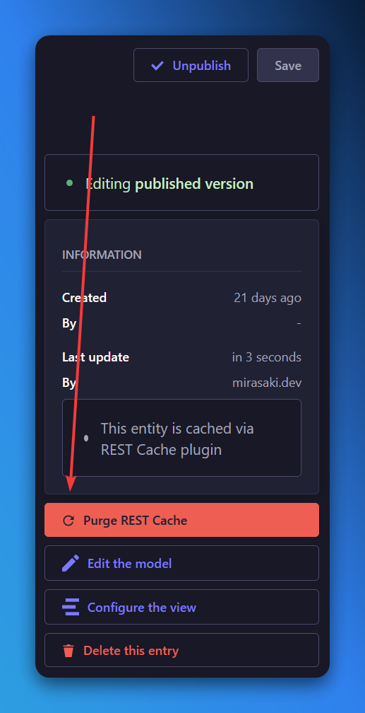

import { ArrowLeftIcon, BoxIcon, BoxesIcon } from 'lucide-react';

## Introduction

The CMS (Content Management System) in MGSM is a powerful interface that allows you to create and manage Content Types. The "Content Type Specifications" category (in the navigation menu) provides detailed information on the predefined Content Types available in MGSM, such as "Products" and "Product Variants". The specification has a lot of information, and you are not meant to read it all at once. Instead, you can use it as a reference when you need to know more about a specific Content Type or field.

### What is a Content Type?

A Content Type is a structured collection of fields that represent a specific type of content. For example, a "Product" Content Type might have fields for the product name, price, description, and image. Content Types are used to define the structure of your content and provide a consistent way to manage and display it.

### What is a Field?

A Field is a single piece of data within a Content Type. Fields can be of different types, such as text, number, date, boolean, or relation. Each field has a name, type, and other settings that define how it behaves and is displayed in the CMS.

### What is a Relation?

A Relation is a special type of field that links one Content Type to another. For example, a "Product" Content Type might have a relation field that links it to a "Variant" Content Type. Relations are used to establish connections between different types of content and create complex data structures.

## Caching

The CMS caches content indefinitely, only invalidating the cache when you update a Content Type or its entries. This means that once a Content Type or entry is created, it will be served from the cache until it is updated. If you're working with nested Content Types, like the `Page | Changelog` (with it's `Changelog Post` entries), you will need to purge the parent (`Page | Changelog` in this case) Content Type to invalidate the cache. The "Purge REST Cache" button is available for all Content Types, and it looks like this:

## Content Type Specifications

<Cards>
  <Card
    title="Products"
    description="Learn more about the Product Content Type and how to create and manage products in the CMS."
    icon={<BoxIcon />}
    href="/docs"
  />
  <Card
    title="Product Variants"
    description="Learn more about the Product Variant Content Type and how to create and manage variants in the CMS."
    icon={<BoxesIcon />}
    href="/docs"
  />
</Cards>

<Card
  className="mt-4"
  title="Back to the Docs"
  description="Return to the main documentation page."
  icon={<ArrowLeftIcon />}
  href="/docs"
/>
