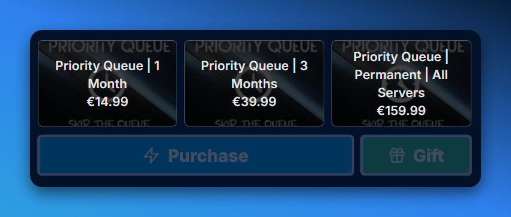
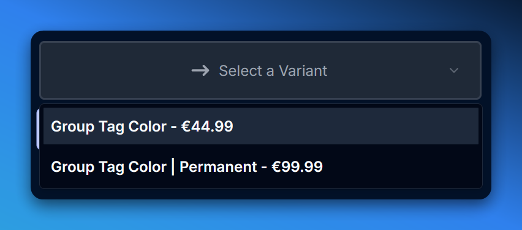

import { FieldBadges } from '@/components/ui/badge';
import { ExternalLinkIcon } from 'lucide-react';

## Introduction

The **Product** Content Type in the CMS is used to define the structure of your products. It includes fields for the product name, price, description, and image, as well as other settings that control how the product is displayed, managed, and which perks are available for it.

## Variants [#product-variants]

Products can have multiple variants that represent different configurations or options for the product. For more information on creating and managing product variants, see the [**Product Variants**](/docs/cms/product-variants) documentation.

## Fields

The Product Content Type includes the following fields: (in order of appearance)

<Callout type="info">
  If you update a field at the product level, it will automatically be updated for all variants as well, unless the field is overridden at the variant level.
</Callout>

### Slug <FieldBadges type='string(slug)' required /> [#slug]

The slug is a unique identifier for the product that is used in URLs and other (technical) contexts. You should try to keep the slug short, descriptive, and easy to remember. Only lowercase letters, numbers, and hyphens (**-**) are allowed in the slug.

<Callout type="warn">
  If you update/change the slug of a product (-variant), the old URL will no longer work. This can lead to broken links, incomplete order histories, and other issues. Be careful when changing slugs after publishing, consider **unpublishing** the product, duplicating it, and updating the slug on the duplicate instead.
</Callout>

### Rank <FieldBadges type='number' required min={0} /> [#rank]

The rank is used to determine the order in which products are displayed on the frontend. Products with a lower rank will be displayed before products with a higher rank. If multiple products have the same rank, they will be displayed in the order they were created. For an overview of your product orders, visit the Collection Type overview page in the CMS - entries here are ordered according to **rank** field.

### External Product URL <FieldBadges type='string(url)' /> [#externalProductUrl]

The external product URL is used to link the product to an external website or service. If the product is available for purchase on another platform, you can provide the URL here to redirect users to the external product page when they click on the product in the frontend. If this field is empty, the product will be displayed as usual on the frontend. Useful for affiliate links, external marketplaces, and other scenarios where the product is not sold directly on your website.

### Price in Cents <FieldBadges type='number' required min={0} /> [#priceInCents]

The price in cents is the base price of the product in the smallest currency unit (e.g., cents for USD). The price is used to calculate the total cost of the product, including any taxes, fees, or discounts that may apply.

### Server Type <FieldBadges type='enum' required options={['PC', 'XBox', 'PlayStation']} /> [#serverType]

The server type is used to determine which server(s) the product is available on. Each product can be associated with one specific server types, or all server types if left empty. The server type is used to filter products on the frontend and determine which products are available for purchase on each server.

### Disabled Servers <FieldBadges type="relation(Server)" multiple /> [#disabledServers]

List of [Servers](/docs/cms/servers) for which the product, or variant, is not available/enabled. If the product/perk is not available on a specific server, you can select the server(s) here to prevent the product from being purchased for that server. This field is useful for products that are only available on certain servers, products that are temporarily disabled on specific servers, and servers that don't allow monetization or purchases.

<Callout type="info">
  You can prevent a server from being monetized altogether by using the [Servers#hiddenFromProductServerSelect](/docs/cms/servers#hiddenFromProductServerSelect) field.
</Callout>

### Name <FieldBadges type='string' required /> [#name]

The (public-facing) name of the product. This field is used to display the product name on the frontend. The name should be descriptive, concise, and indicative of the product's purpose or function.

### Description <FieldBadges type='text' required /> [#description]

The description of the product. This field is used to provide additional information about the product, such as its features, benefits, and use cases. Try to keep the description relatively short, informative, and engaging to entice users to purchase the product. We recommend **75-100 characters** to optimize SEO and to not overwhelm the user.

<Callout type="info">
  You can use HTML syntax in the description field to format the text and add links. For more information on HTML syntax, see the [HTML Guide](https://www.w3schools.com/html/). For example, you can use `<a href="https://example.com">Link Text</a>` to create a hyperlink, `<strong>Bold Text</strong>` to make text bold, and `Colored Text` to change the text color.
</Callout>

### Can Be Gifted <FieldBadges type='boolean' defaultValue={true} /> [#canBeGifted]

Determines whether the product can be gifted to other users. If this field is enabled, users will have the option to gift the product to another user during the purchase process. If this field is disabled, the product cannot be gifted, gift-cards can no longer be redeemed for this product, and the option to gift the product will not be displayed on the frontend.

### Excluded from Promotions <FieldBadges type='boolean' defaultValue={false} /> [#excludedFromPromotions]

Determines whether the product is excluded from promotions, discounts, and other marketing campaigns. If this field is enabled, promotions and discounts can no longer be applied for this product, new promotions cannot be created for this product, and the product will not be included in any marketing campaigns.

<Callout type="info">
  Examples of marketing campaigns include seasonal sales, holiday promotions, limited-time offers, and other events where products are discounted or promoted to increase sales and engagement. These are not yet implemented in MGSM, but will be in the future.
</Callout>

### Product Info has Server Select <FieldBadges type='boolean' defaultValue={false} /> [#productInfoHasServerSelect]

Determines whether the product has a server select dropdown on the product info page. If this field is enabled, users will be able to select the server they want to purchase the product for on the product info page (`/store/product`). If this field is disabled, the server select dropdown will be displayed during the checkout process (`/store/product/purchase`) instead.

### Images <FieldBadges type='media' required multiple /> [#images]

Collection of images for the product. These images are used to showcase the product on the frontend. You can upload multiple images for each product, and the first image in the list serves as the primary image that will be displayed as the product thumbnail, all other images are displayed in the product gallery/image carousel. If you're selling physical items, we recommend using high-quality images that are clear, well-lit, and visually appealing to attract users and encourage them to purchase the product.

<Callout type="info">
  We automatically optimize images uploaded to the CMS (using **lossless** compression), but you can use [Tinify](https://tinypng.com/) to manually compress and optimize your images with more control, resulting in better optimization. This will reduce the file size of your images, improve page load times, and enhance the user experience on your website.
</Callout>

### Details <FieldBadges type='Blocks Content' required /> [#details]

The details field represents the bulk of the product information. It is used to provide additional information about the product, such as its features, benefits, and use cases. The details field can include text, images, links, and other content that helps users understand the product and make an informed purchase decision. We recommend using the details field to provide a comprehensive overview of the product, including its key features, specifications, and pricing information.

<Callout type="info">
  The details field is an [WYSIWYG](https://en.wikipedia.org/wiki/WYSIWYG) editor that allows you to format text, add images, embed videos, and create links. You can use the toolbar at the top of the editor to format text, add headings, lists, tables, and insert media. For more information on using the WYSIWYG editor, see the [Editor Guide](https://docs-v4.strapi.io/user-docs/content-manager/writing-content) (MGSM uses **Blocks** Content, not **Rich Text/Markdown**).
</Callout>

### Perks <FieldBadges type='Component' /> [#perks]

<Card
  title="Perks"
  href="/docs/cms/products/perks"
  icon={<ExternalLinkIcon />}
>
  Learn more about the Perks component for the Product Content Type and how to create and manage perks for products in the CMS.
</Card>

### Addons

Addons are additional products or services that can be purchased alongside the main product to enhance the user experience and provide additional value. Addons can include in-game items, virtual currency, exclusive content, early access, and other rewards that complement the main product and provide users with a more comprehensive experience.

<Callout type='warn'>
  Addons are **not** implemented yet. While the Content Type/component is defined and available in MGSM, the functionality is not yet implemented. We are working on adding support for addons in a future update, and will provide more information on how to create and manage addons in the CMS once the feature is available.
</Callout>

### Form Input <FieldBadges type='Component' multiple /> [#formInput]

<Card
  title="Form Input"
  href="/docs/cms/products/form-input"
  icon={<ExternalLinkIcon />}
>
  Learn more about the Form Input component for the Product Content Type and how to collect additional information from users when they purchase a product.
</Card>

### Modules <FieldBadges type='Component' multiple /> [#modules]

<Card
  title="Modules"
  href="/docs/cms/products/modules"
  icon={<ExternalLinkIcon />}
>
  Learn more about Modules for the Product Content Type and how to manage modules for products in the CMS.
</Card>

### Estimated Fulfillment Notice <FieldBadges type='Blocks Content' /> [#estimatedFulfillmentNotice]

The estimated fulfillment notice is used to provide users with an estimate of when the product will be delivered or fulfilled after purchase. This field is used to set expectations for users and reduce confusion or frustration about the delivery process. The estimated fulfillment notice can include information about the delivery time, delivery method, and any other relevant details that users need to know before purchasing the product.

<Callout type="info">
  Did you know that you can use [Messages Module](/docs/cms/products/modules#messages) to display an interactive timer that counts down to the estimated fulfillment time? This can help users visualize the delivery process and understand how long it will take for the product to be delivered after purchase.
</Callout>

<Callout type="warn">
  If you leave this empty, or provide inaccurate information, users may be confused or frustrated about the delivery process, leading to negative reviews, chargebacks, and other issues. In additional, you would also be breaking your site's [Terms of Service](/docs/cms/legal/fulfillment-policy).
</Callout>

### Inherits Module Configuration <FieldBadges type='relation(Product)' /> [#inheritsModuleConfiguration]

The inherits module configuration field can be used to inherit all Modules (including Perks) from another product. This field is used to copy the module configuration from one product to another, saving time and effort when creating similar products with the same modules. If you select a product in this field, **all** modules from the selected product will be copied to the current product, including the standalone [Perks](/docs/cms/products/perks), [Module Configuration](/docs/cms/products/modules), and [Perk Modules](/docs/cms/products/modules/perks).

<Callout type="warn">
  Generally speaking, you want to keep product that you use as a template for other products (what we refer to as a &quot;Module Configuration&quot;) unpublished, to prevent users from purchasing it.
</Callout>

### Module Configuration Inherited By <FieldBadges type='relation(Product)' multiple /> [#moduleConfigurationInheritedBy]

Collection of products that inherit the module configuration from the current product. This field is used to track which products have inherited the module configuration from the current product, and to manage the inheritance relationship between products. If you update the module configuration of the current product, the changes will be automatically applied to all products that inherit the module configuration from the current product.

### Include Product in Variants <FieldBadges type='boolean' defaultValue={false} /> [#includeProductInVariants]

Determines whether the product is included in the list of variants for the product. If this field is enabled, the product will be available as a choice in the list of variants for the product. If this field is disabled, the product will not be available as a choice in the list of variants for the product, and users will not be able to purchase the (base) product, or select it as a variant when purchasing the product.

### Variants are Standalone Products <FieldBadges type='boolean' defaultValue={false} /> [#variantsAreStandaloneProducts]

Determines whether the variants of the product are standalone products. If this field is enabled, the variants of the product will be treated as standalone products that can be purchased independently of the base product, and included in the Product overview page. If this field is disabled, the variants of the product will be treated as options or configurations of the base product, and users will only see the variants as (variant) options when purchasing the product.

### Select Variant Style <FieldBadges type='enum' options={['variant-tiles', 'select-menu']} /> [#selectVariantStyle]

The select variant style field is used to determine how variants are displayed on the frontend. See below for examples of the available styles:

> Example of the variant-tiles style for the selectVariantStyle field. Variants are displayed as tiles with images, names, and prices for each variant.

> Example of the select-menu style for the selectVariantStyle field. Variants are displayed as a dropdown menu with a list of variant names that users can select from.

### Variants <FieldBadges type='relation(Product Variant)' multiple /> [#variants]

Collection of variants for the product. Variants represent different configurations or options for the product, such as size, color, quantity, and other attributes that affect the price, availability, and features of the product. You can create multiple variants for each product, and customize the name, price, description, and other settings for each variant to provide users with a personalized shopping experience.

<Card
  title="Product Variants"
  href="/docs/cms/product-variants"
  icon={<ExternalLinkIcon />}
>
  Learn more about the Product Variants Content Type and how to create and manage variants for your products in the CMS.
</Card>
