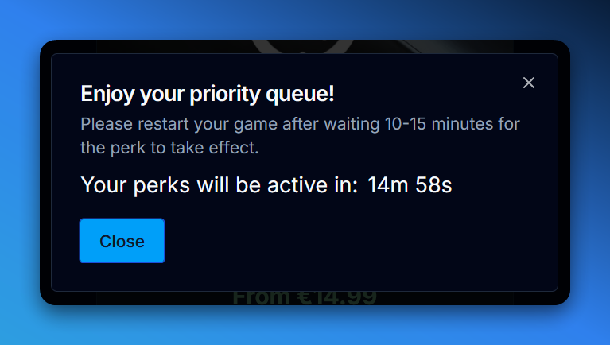
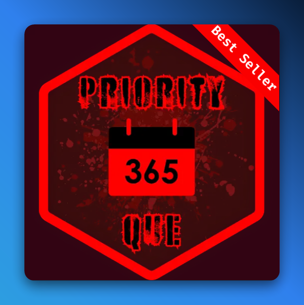
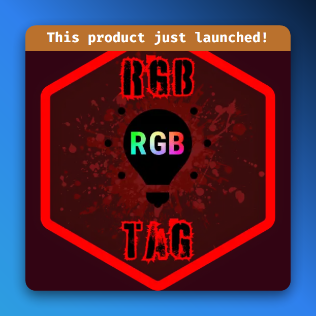
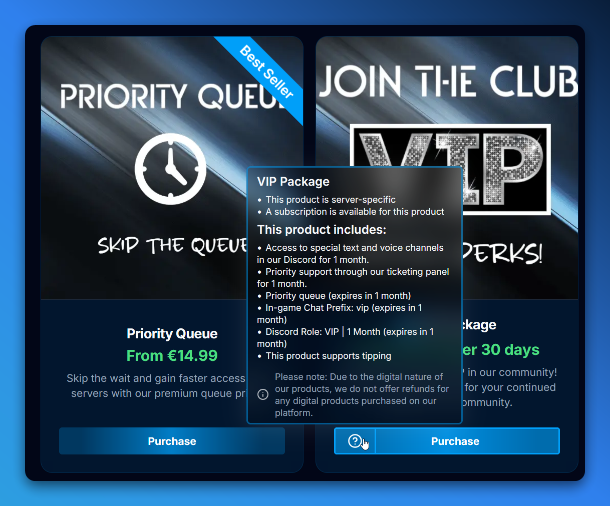

import { FieldBadges } from '@/components/ui/badge';

## Introduction

Modules are a way to extend the functionality of the Product and Product Variant content types. Modules can be used to add additional fields, functionality, or integrations to your products. Modules can be added to a product or product variant by selecting them in the `Modules`field for the product or product variant. Available modules range from informational modules like `Messages` and `Info Display` to integrations like `Discord Ticket`. You can add as many modules as you want to any product or product variant.

### Eligibility <FieldBadges type='Component' hideOptional /> [#eligibility]

The `Eligibility` module allows you to set up eligibility requirements for a product or product variant. This can be used to restrict access to a product or product variant based on an external service. For example, you could require that a user be a member of a specific Discord server, has a specific role in the server, or has a specific number of hours in a game.

#### Success Message Appendix <FieldBadges type='string' /> [#eligibility#successMessageAppendix]

A message that will be appended to the success message when a user is eligible to purchase the product.

#### Is LB Mods Group Requirement <FieldBadges type='boolean' required /> [#eligibility#isLBModsGroupRequirement]

Whether or not the user is required to be in a [Advanced Groups](https://lbmaster.de/product.php?id=4) group to purchase the product.

#### Request <FieldBadges type='Component' hideOptional /> [#eligibility#request]

The request that will be made to the external service to determine if the user is eligible to purchase the product or variant.

##### URL <FieldBadges type='string(url)' required /> [#eligibility#request#url]

The URL that the request will be made to.

##### Method <FieldBadges type='enum' required options={['GET', 'POST']} /> [#eligibility#request#method]

The method that will be used to make the request.

##### Headers <FieldBadges type='JSON' /> [#eligibility#request#headers]

Key-value pairs that will be added to the request headers. Omits the `Authorization` header.

##### Body <FieldBadges type='JSON' /> [#eligibility#request#body]

The body of the request. Only used if the method is `POST`. The body will be sent as JSON, and invalid JSON will cause the request to fail.

### Messages <FieldBadges type='Component' hideOptional /> [#messages]

The `Messages` module allows you to customize the messages that are displayed to the user when they interact with the product or product variant. This can be used to provide additional information to the user or to customize the messages that are displayed when a user purchases the product.

#### Success Message <FieldBadges type='Component' hideOptional /> [#messages#successMessage]

The message that will be displayed to the user when they successfully purchase the product.

##### Title <FieldBadges type='string' required /> [#messages#successMessage#title]

The title of the success message.

##### Description <FieldBadges type='string' /> [#messages#successMessage#description]

The description of the success message.

#### Error Message <FieldBadges type='Component' hideOptional /> [#messages#errorMessage]

The message that will be displayed to the user when an error occurs while their purchase is being processed.

##### Title <FieldBadges type='string' required /> [#messages#errorMessage#title]

The title of the error message.

##### Description <FieldBadges type='string' /> [#messages#errorMessage#description]

The description of the error message.

#### Success Message Timer Active <FieldBadges type='boolean' defaultValue={false} /> [#messages#successMessageTimerActive]

Whether or not the success message timer is active, and displayed alongside the success message. If the timer is active, a countdown will appear when a user successfully purchases the product. It looks like this:

#### Success Message Timer Seconds <FieldBadges type='number' min={0} max={2147483647} /> [#messages#successMessageTimerSeconds]

The number of seconds that the success message timer will count down for.

### Meta <FieldBadges type='Component' hideOptional /> [#meta]

The `Meta` module allows you to add metadata to a product or product variant. This can be used to add badges to a product or product variant, like "New" or "Best Seller".

#### New <FieldBadges type='boolean' required /> [#meta#new]

Whether or not the product or product variant is new.

#### Best Value <FieldBadges type='boolean' required /> [#meta#bestValue]

Whether or not the product or product variant is the best value, among it's variants, and other "similar" products.

#### Best Seller <FieldBadges type='boolean' required /> [#meta#bestSeller]

Whether or not the product or product variant is the best seller. You should only have one product or product variant marked as the best seller.

#### Flare Style <FieldBadges type='enum' options={['ribbons', 'banners']} /> [#meta#flareStyle]

The style of the flare that will be displayed on the product or product variant. The flare is a visual indicator that is displayed on the product or product variant. It can be a ribbon or a banner.

> Example of the ribbon flare style.

> Example of the banner flare style.

### Discord Ticket <FieldBadges type='Component' hideOptional /> [#discordTicket]

The `Discord Ticket` module allows you to create a ticket in a Discord server when a user purchases a product or product variant. This can be used to provide support to users who have purchased a product or product variant, or to handle the fulfillment of a custom order.

1. Add the @Ticketing bot to your Discord server: [add bot](https://discord.com/oauth2/authorize?client_id=1199062734436843641&permissions=8&integration_type=0&scope=applications.commands+bot)
2. Run the `/setup` command, and answer all the questions the bot asks you.
    - `What should the name of this panel be?` - We recommend using the name of your store.
    - `What should the slug of this panel be?` - We recommend setting this to `order`.
    - `In what channel should this panel be created?` - Set this to a channel that is **only** accessible by your staff.
    - `Under what category should open tickets be created?` - Set this to a category that is **only** accessible by your staff.
    - `What roles should be able to handle tickets?` - Set this to a staff role that will handle/manage your ticket orders.
3. In the message that appears, click `Create First Action`, and answer some more questions.
    - `What text should be displayed in the button which will be used to create a ticket.` - We recommend setting this to `Create Ticket`.
    - `Which emoji should be displayed in the button which will be used to create a ticket.` - We recommend setting this to `🎫`.
    - `What color should the button (that will be used to create tickets for this action) be?` - We recommend setting this to `GREEN`.
    - `What should the ticket index be for this action, determines the starting ticket index/number for this action.` - We recommend setting this to `0`.
    - `What should the description be for this action?` - We recommend setting this to `Tickets for orders from our MGSM store.`.
4. When you're done, run the `/control-panel deploy` command, while selecting your newly created panel.
5. Click the link in the message that appears, indicated by the `Jump` text.
6. Click the `Create Ticket` button.
7. In the message that appears, click the channel link to go to the newly created ticket.
8. Run the `/panel-action-ids` command inside this newly created ticket to obtain the panel id and action id for this integration.

#### Panel Id <FieldBadges type='string' required /> [#discordTicket#panelId]

Create a ticket in Discord with @Ticketing, and use the `/panel-action-ids` command to get the panel id. [This process is explained above.](#discordTicket)

#### Action Id <FieldBadges type='string' required /> [#discordTicket#actionId]

Create a ticket in Discord with @Ticketing, and use the `/panel-action-ids` command to get the action id. [This process is explained above.](#discordTicket)

### Tipping <FieldBadges type='Component' hideOptional /> [#tipping]

The `Tipping` module allows you to add a tipping feature to a product or product variant. This can be used to allow users to leave a tip, cover transaction fees, or leave a custom message to boost the morale of your staff :).

#### Enabled <FieldBadges type='boolean' required /> [#tipping#enabled]

Whether or not the current tipping module is enabled for the product or product variant.

#### Allow Cover Transaction Fee <FieldBadges type='boolean' defaultValue={false} /> [#tipping#allowCoverTransactionFee]

Whether or not the user can cover the MGSM transaction/application fee when they leave a tip. This setting is ignored if your store is using the inclusive MGSM fee setting from `Site` > `Billing` > `mgsmProcessingFeeInclusive`, as the fee is already covered by the user when this setting is enabled.

#### Allow Custom Tip Amount <FieldBadges type='boolean' defaultValue={false} /> [#tipping#allowCustomTipAmount]

Allow the user to tip your store a custom amount, no MGSM fees are paid over these tips. Subject to max donation amount defined in `Site` > `Billing` > `maxDonationAmount`.

#### Increase Transaction Fee Percentage <FieldBadges type='number' min={0} max={100} /> [#tipping#increaseTransactionFeePercentage]

Should we charge an additional application/transaction fee for this product? This fee is for your store/instance, and MGSM fees are not paid over these "store configured fees".

#### Collect Custom Message <FieldBadges type='boolean' defaultValue={false} /> [#tipping#collectCustomMessage]

Allow the user to leave a custom message for you and your team during checkout.

#### Leave Tip Text <FieldBadges type='string' /> [#tipping#leaveTipText]

The text that will be displayed to the user in the "Leave a Tip" box.

#### Custom Tip Line Item Name <FieldBadges type='string' /> [#tipping#customTipLineItemName]

The name of the line item that will be added to the user's cart/checkout session when they leave a custom tip.

#### Custom Tip Line Item Description <FieldBadges type='string' /> [#tipping#customTipLineItemDescription]

The description of the line item that will be added to the user's cart/checkout session when they leave a custom tip.

#### Custom Tip Line Item Image <FieldBadges type='media' /> [#tipping#customTipLineItemImage]

The image that will be displayed alongside the line item that will be added to the user's cart/checkout session when they leave a custom tip.

#### Store Fee Line Item Name <FieldBadges type='string' /> [#tipping#storeFeeLineItemName]

The name of the line item that will be added to the user's cart/checkout session when using [`increaseTransactionFeePercentage`](#tipping#increaseTransactionFeePercentage).

#### Store Fee Line Item Description <FieldBadges type='string' /> [#tipping#storeFeeLineItemDescription]

The description of the "Store Configured Fee" line item.

#### Store Fee Line Item Image <FieldBadges type='media' /> [#tipping#storeFeeLineItemImage]

The image that will be displayed alongside the "Store Configured Fee" line item.

#### Leave Message Text <FieldBadges type='string' /> [#tipping#leaveMessageText]

The text that will be displayed to the user in the "Leave a Message" box.

### Info Display <FieldBadges type='Component' hideOptional /> [#infoDisplay]

The `Info Display` module allows you to customize the information that is displayed to the user when they view a product or product variant. This can be used to provide additional information about the product or product variant, like the product's perks or the things the user should know about the product.

It looks like this when enabled/active:

#### Tooltip Text <FieldBadges type='string' /> [#infoDisplay#tooltipText]

The text that will be displayed at the bottom of the tooltip when the user hovers over the info display icon.

#### Display Product Info <FieldBadges type='boolean' required /> [#infoDisplay#displayProductInfo]

Should we generate and render a list of product information?

#### Display Product Perks <FieldBadges type='boolean' required /> [#infoDisplay#displayProductPerks]

Should we generate and render a list of product perks?

#### Free Text Perks <FieldBadges type='Component' /> [#infoDisplay#freeTextPerks]

A list of free text perks that will be displayed to the user.

<Callout type="warn">
  Note: Free text perks do not **do** anything, they are only displayed to the user.
</Callout>

### User Chooses Price <FieldBadges type='Component' hideOptional /> [#userChoosesPrice]

The `User Chooses Price` module allows you to create a product or product variant where the user can choose the price they want to pay. This can be used to allow users to pay what they want for a product, useful for donations/support or for products where the price is subjective.

#### Active <FieldBadges type='boolean' required /> [#userChoosesPrice#active]

Whether or not the user chooses price module is active for the product or product variant.

#### Min Amount in Cents <FieldBadges type='number' min={0} max={10000} /> [#userChoosesPrice#minAmountInCents]

The minimum amount that the user can pay for the product or product variant.

<Callout type="warn">
  Note: There is currently a global maximum donation amount of `100.00` (largest currency unit) to prevent charge-back fraud. If you need to accept larger donations, please contact our support team in the [Discord](https://discord.gg/mgsm) server.
</Callout>

#### Max Amount in Cents <FieldBadges type='number' min={0} max={10000} /> [#userChoosesPrice#maxAmountInCents]

The maximum amount that the user can pay for the product or product variant.

#### Choices <FieldBadges type='JSON' /> [#userChoosesPrice#choices]

A list of prices that the user can choose from. The prices should be in cents/smallest currency units.

#### User Prompt Text <FieldBadges type='string' /> [#userChoosesPrice#userPromptText]

The text that will be displayed to the user when they are prompted to choose/provide a price.

#### Price Display Text <FieldBadges type='string' /> [#userChoosesPrice#priceDisplayText]

The text that will be displayed, instead of the normal price, on the product card, and other places where the price is displayed.

### Custom Text Overrides <FieldBadges type='Component' hideOptional /> [#customTextOverrides]

The `Custom Text Overrides` module allows you to customize the text that is displayed to the user when they interact with the product or product variant. This can be useful in cases where the context is not a normal product, like a donation or a custom order.

#### Action Text <FieldBadges type='string' defaultValue={'Purchase'} /> [#customTextOverrides#actionText]

The text that will be displayed on the button that the user interacts with to purchase the product or product variant. Most prominently displayed on the product card.

### Restricted Access <FieldBadges type='Component' hideOptional /> [#restrictedAccess]

The `Restricted Access` module allows you to restrict access to a product or product variant based on the user's Discord ID. This can be used to create products that are only available to specific (Discord) users (useful when testing with your team), or VIPs (in conjunction with the `Eligibility` module).

#### Active <FieldBadges type='boolean' required /> [#restrictedAccess#active]

Whether or not the restricted access module is active for the product or product variant.

#### Only Active for Discord Ids <FieldBadges type='JSON' /> [#restrictedAccess#onlyActiveForDiscordIds]

A list of Discord IDs that the product or product variant will be available to. The IDs should be in the format `123456789012345678`.

If the value is not a valid JSON array of string, the setting is ignored altogether.
