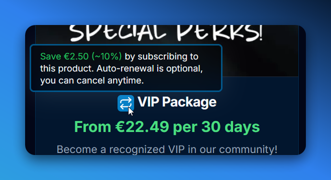

import { FieldBadges } from '@/components/ui/badge';

## Introduction

Perks are modules that can be added to a Product or Product Variant content type. They are used to add additional rewards or benefits to a product. Perks can be added to a product or product variant by selecting them from the "Modules" field in the CMS. You can as many perk component modules as you want. If you duplicate a perk module, it will override the existing one (except for repeating modules, indicated by the `multiple` badge, like [Skin Configuration](#skin-configuration)).

### CFTools Stat Reset <FieldBadges type='Component' hideOptional /> [#cftoolsStatReset]

The CFTools Stat Reset module resets the stats of a player in the CFTools database when purchased. The component can be configured to reset the stats of the user/player that purchases it, or the stats of another player (by entering their Steam ID, this comes with some integrity risks).

#### Status <FieldBadges type='boolean' required /> [#cftoolsStatReset#status]

Indicates wether or not this perk is currently active/enabled. If the field is set to `true`, the perk will be processed when the product, or variant, is purchased. You can temporarily disable this perk by setting this field to `false` - useful during testing or CFTools maintenance/outages.

#### Input Name <FieldBadges type='relation(Form Input)' /> [#cftoolsStatReset#inputName]

The `name` of the Form Input field that will be used to collect the Steam ID of the player whose stats will be reset. Please see the [Form Input](/docs/cms/products/form-input) documentation for more information on how to create and use form inputs.

### Group Tag Color <FieldBadges type='Component' hideOptional /> [#chatTagColor]

The Group Tag Color module allows users to select a custom color for their chat tag, applying to their entire (in-game) player group. Please see the [Group Tag Color](/docs/integrations/lb-master/group-tag-colors) documentation for more information on the server-side implementation.

#### Status <FieldBadges type='boolean' required /> [#chatTagColor#status]

Indicates wether or not this perk is currently active/enabled. If the field is set to `true`, the perk will be processed when the product, or variant, is purchased. You can temporarily disable this perk by setting this field to `false` - useful during testing or server migrations.

#### Once Per Group <FieldBadges type='boolean' required /> [#chatTagColor#oncePerGroup]

Indicates wether or not this perk can be purchased multiple times by the same group. If the field is set to `true`, the perk can only be purchased once per group, and subsequent purchases will be denied. If the field is set to `false`, the perk can be purchased multiple times by the same group, by any of it's member.

#### Input Name <FieldBadges type='relation(Form Input)' required /> [#chatTagColor#inputName]

The `name` of the Form Input field that will be used to collect the color code from the user. Please see the [Form Input](/docs/cms/products/form-input) documentation for more information on how to create and use form inputs.

#### Use Redeem Points <FieldBadges type='boolean' /> [#chatTagColor#useRedeemPoints]

The **Group Tag Color** module comes with 2 separate configurations/options.

- When the field is set to `false`, or is left empty, a color is required to be collected during the checkout session, which will be automatically applied to the user's group when the purchase is completed.
- When the field is set to `true`, a color no longer needs to be collected during the checkout session. Instead, the user can redeem points to change their group's color in-game (Map > Group).

#### Redeem Points Is Infinity <FieldBadges type='boolean' /> [#chatTagColor#redeemPointsIsInfinity]

When `Use Redeem Points` is set to `true`, this field can be used to assign infinite points to the user, allowing them to change their group's color an unlimited number of times - until you decide to wipe the data file on your server.

### Killfeed Color <FieldBadges type='Component' hideOptional /> [#killfeedColor]

The Killfeed Color module allows users to select a custom color for the in-game killfeed. This perk is only available as a `player` perk. Please see the [Killfeed Color](/docs/integrations/lb-master/killfeed-colors) documentation for more information on the server-side implementation.

#### Status <FieldBadges type='boolean' required /> [#killfeedColor#status]

Indicates wether or not this perk is currently active/enabled. If the field is set to `true`, the perk will be processed when the product, or variant, is purchased. You can temporarily disable this perk by setting this field to `false` - useful during testing or server migrations.

#### Input Name <FieldBadges type='relation(Form Input)' required /> [#killfeedColor#inputName]

The `name` of the Form Input field that will be used to collect the color code from the user. Please see the [Form Input](/docs/cms/products/form-input) documentation for more information on how to create and use form inputs.

### Skin Configuration <FieldBadges type='Component' multiple hideOptional /> [#skinConfiguration]

The Skin Configuration module allows users to select a custom skin for their in-game player model. Multiple skin configurations can be provided per product. Please see the [Skin Configuration](/docs/integrations/lb-master/skin-configuration) documentation for more information on the server-side implementation.

#### Status <FieldBadges type='boolean' required /> [#skinConfiguration#status]

Indicates wether or not this perk is currently active/enabled. If the field is set to `true`, the perk will be processed when the product, or variant, is purchased. You can temporarily disable this perk by setting this field to `false` - useful during testing or server migrations.

#### Type <FieldBadges type='enum' required options={['Player', 'Group']} /> [#skinConfiguration#type]

The `type` of the skin configuration. If the field is set to `Player`, the skin will be made available only to the user that makes the purchase. If the field is set to `Group`, the skin will be made available to the entire group of the user that makes the purchase.

#### Permission Group Name <FieldBadges type='string' required /> [#skinConfiguration#permissionGroupName]

The name of the permission group that will be used to apply the skin to the user or group. Please see the [Skin Configuration](/docs/integrations/lb-master/skin-configuration) documentation for more information on the server-side implementation.

### Subscription <FieldBadges type='Component' hideOptional /> [#subscription]

The Subscription module allows users to subscribe to a product, or variant, for an indefinite period of time. Subscriptions are automatically renewed at the end of each cycle, until the user cancels their subscription - unlike one-time purchases, which are only billed and processed once.

#### Interval Count <FieldBadges type='number' required min={1} max={1095} /> [#subscription#intervalCount]

The number of intervals in 1 cycle. For example, if the interval count is set to `1`, the subscription will renew after 1 day, week, month, or year - depending on the [Interval (Unit)](#subscription#intervalUnit) field.

#### Interval (Unit) <FieldBadges type='enum' required options={['day', 'week', 'month', 'year']} /> [#subscription#intervalUnit]

The unit of time that the subscription will renew after. For example, if the interval unit is set to `day`, and the [Interval Count](#subscription#intervalCount) is set to `30`, the subscription will renew after 30 days.

#### Trial Period Days <FieldBadges type='number' min={0} /> [#subscription#trialPeriodDays]

The number of days that the user will have access to the product, or variant, before the subscription begins. If the field is set to `0`, or left empty, the subscription will begin immediately after the purchase is completed.

#### Price in Cents per Cycle <FieldBadges type='number' min={75} max={999999} /> [#subscription#price]

The price of the subscription in the smallest currency unit (cents). For example, if the price is set to `1500`, the subscription will cost $15.00 per cycle (per 30 days, in our example above). If this field is left empty, the base [Price](/docs/cms/products#priceInCents) of the product or variant will be used instead.

#### Default Subscribing Active <FieldBadges type='boolean' /> [#subscription#defaultSubscribingActive]

Whether or not the user is subscribing to the product by default.

- If [Subscription Method](#subscription#subscriptionMethod) is set to `Disabled`, the user can no longer subscribe to the product.
- If [Subscription Method](#subscription#subscriptionMethod) is set to `Auto Subscribe`, the user will be automatically subscribed to the product, and wil not be able to receive the product as a one-time purchase.
- If [Subscription Method](#subscription#subscriptionMethod) is set to `Checkbox to Subscribe in Order Details`, the checkbox will be checked by default.
- If [Subscription Method](#subscription#subscriptionMethod) is set to `Toggle Button in Checkout`, the toggle button will be enabled by default.
- If [Subscription Method](#subscription#subscriptionMethod) is set to `Separate Button in Product Info`, no action will be taken, as the user will still have to click either "Subscribe" or "Purchase" to proceed.
- If [Subscription Method](#subscription#subscriptionMethod) is set to `Payment Plan Comparison`, the payment plan that has the subscription will receive extra flare.

<Callout type='info'>
  The subscription will be automatically renewed at the end of each cycle, until the user cancels their subscription. The user can cancel their subscription at any time by visiting their account page.
</Callout>

#### Show Badge on Product Card <FieldBadges type='boolean' /> [#subscription#showBadgeOnProductCard]

Whether or not the subscription badge will be displayed on the product card. It looks like this:

#### Subscription Method <FieldBadges type='enum' required options={['Many, see below']} /> [#subscription#subscriptionMethod]

The method that will be used to subscribe to the product. The available options are:

- **Disabled**: The user can no longer subscribe to the product.
- **Auto Subscribe**: The user will be automatically subscribed to the product, and wil not be able to receive the product as a one-time purchase.
- **Checkbox to Subscribe in Order Details**: A checkbox will be added to the order details page (checkout step 2).
- **Toggle Button in Checkout**: A toggle button will be added to the checkout page (checkout step 3), allowing the user to choose between "One-Time" and "Subscription".
- **Separate Button in Product Info**: A separate button will be added to the product info page, allowing the user to choose between "Subscribe" and "Purchase".
- **Payment Plan Comparison**: A payment plan comparison will be rendered on the product info page, showing the user the benefits of subscribing to the product.
