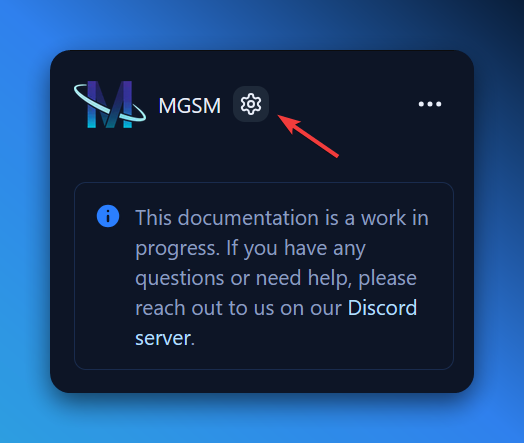

## Introduction

Welcome to the getting started guide for MGSM! This guide will help you set up the platform for your game-server/community, so you can start monetizing your servers and provide a better experience for your players - and, at the same time, save yourself and your team a lot of time and effort.

## Documentation

The documentation is split into several sections, which you can find in the sidebar. If you're looking for something specific, you can use the search bar at the top-left of the page (top-right on mobile).

## Personalization

Please click the following icon at the top-left of the page to personalize the documentation for your instance. This will ask you for your instance's name and URLs, and will update the documentation to reflect your instance's information.

## Contributions

If you'd like to contribute to the documentation, you can find the source code on [GitHub](https://github.com/Mirasaki-MGSM/docs). We welcome all contributions, big or small! Do take note of the "Edit on GitHub" button at the bottom of each page, which will take you directly to the source file for that page.
