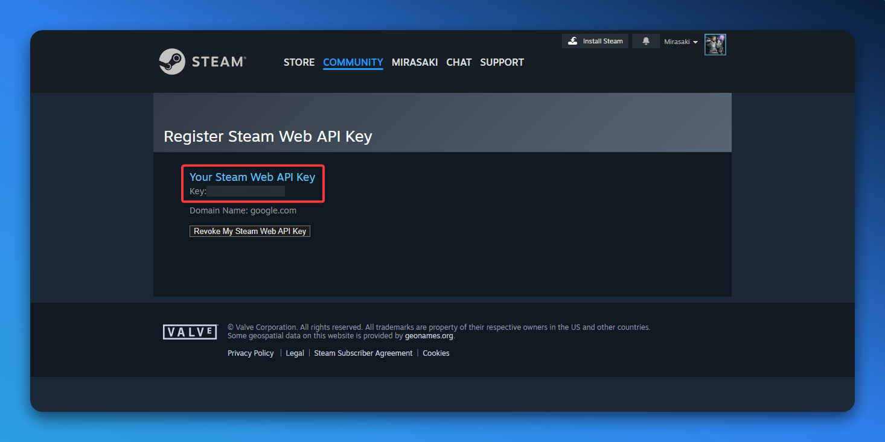

## Overview

The Steam integration for MGSM allows you to log in with your Steam account, link your Steam account to Discord, and more. 

## API Key

To allow your users to connect their Steam account to MGSM, an API key is required. You can get an API key by following these steps:

<Callout type="warn">
    We recommended using an API key that is not used by [Omega Manager](https://help.cftools.com/en/omega-manager), as the Steam Mobile Authenticator is required for some actions - which is not compatible with Omega Manager.
</Callout>

1. Go to the [Steam Web API website](https://steamcommunity.com/dev/apikey) and log in with your Steam account.
2. If you have a key already, simply copy it. If not, provide a domain name and click on "Register".

## Account Linking

When you sign in with Discord on an MGSM instance/website, your Discord Connections will be checked for a Steam account.

- If a Steam account is found, that account will be set as your linked Steam account by default.
    - You can always change this (default) Steam linked account on your profile page.
    - Logging in with Steam directly always takes priority over Discord connections.
- If no Steam account is found, you will be prompted to link your Steam account (by signing in with Steam).

For completeness, Xbox and PlayStation accounts are automatically linked if found in your Discord connections as well - these do not support direct login.
